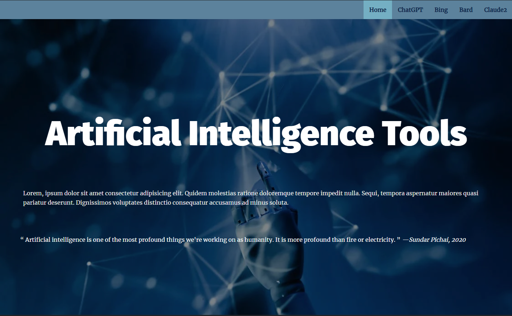
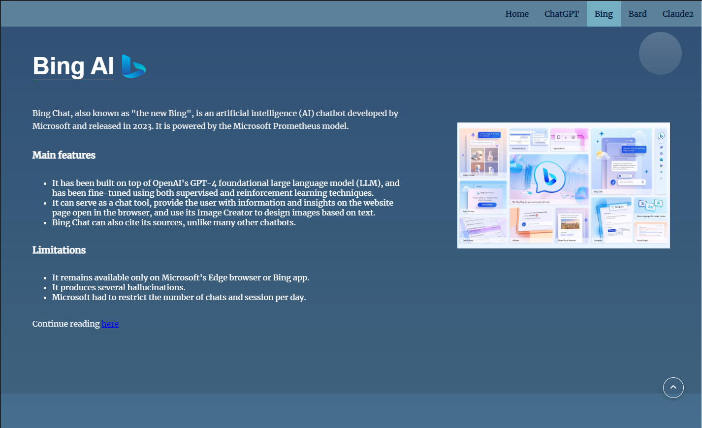
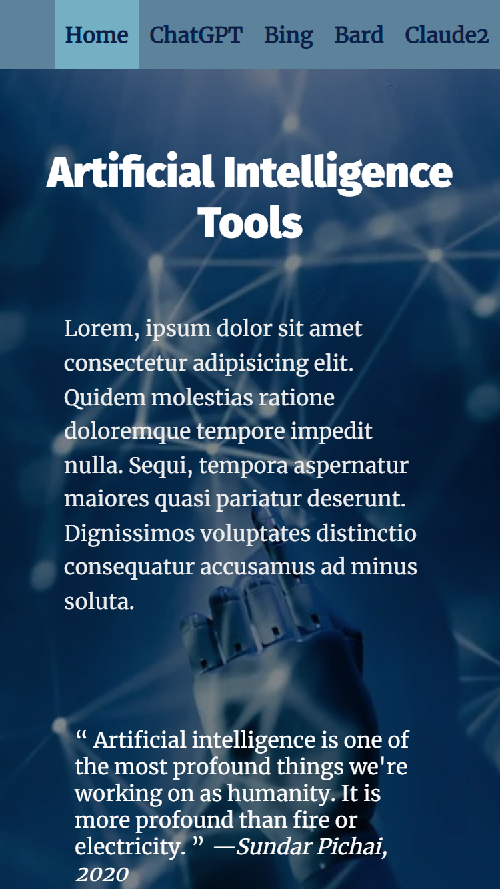
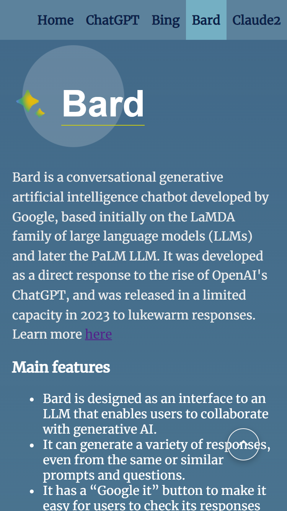

# Udacity Nanodegree

Frontend Web Development Fundamentals

## 🎓 Capstone Project: Landing Page Project

### 📝 Instructions

The starter code for this project was sourced from: [Udacity](https://github.com/udacity/cd0428-landing-page) (Credits to Udacity) as mentioned in the project instructions (Udacity Classroom).

I began by forking the repository and then cloning it to my local environment to make the necessary modifications. The initial code provided HTML and CSS styling, which enabled the display of a static version of the Landing Page project.

My primary task was to convert this static project into an interactive one by making modifications to the HTML, CSS, and, most significantly, the JavaScript file."

### 📖 Main Topic

This landing page is about the various AI tools that we can use to enhance our work or studies. I chose this topic because AI tools are highly beneficial for delivering better results and improving efficiency and efficacy nowadays. Thus, I decided to undertake this Capstone Project to become more familiar with AI tools by developing a landing page with examples and information on some of them.

However, considering the vast number of AI tools available currently, this page specifically focuses on AI chatbots and the ones that offer at least some features for free.

### 🛠 Tools

 |Tool| Version|
 |----|--------|
 |HTML|5|
 |CSS|3|
 |JavaScript| ES6|
 |Visual Studio Code| 1.80.1|
 |Git|2.41.0|
 |Github repository| |

### Landing page snapshot

- [X] Desktop Version

- [x] Mobile and tablet version

### Landing page deployment

This page was deployed on GitHub pages, you can see it on [this link 🔗]()

### 📚 Bibliography and Resources

1. ChatGPT

   1.1 [OpenAI](https://openai.com/blog/chatgpt)

   1.2 [Wikipedia](https://en.wikipedia.org/wiki/ChatGPT)

2. Bing

   2.1 [Microsoft](https://www.microsoft.com/en-us/bing?form=MA13FV)

   2.2 [Wikipedia](https://en.wikipedia.org/wiki/Microsoft_Bing)

3. Bard

   3.1 [Google](https://ai.google/static/documents/google-about-bard.pdf)

   3.2 [Wikipedia](https://en.wikipedia.org/wiki/Bard_(chatbot))

4. Claude 2

   4.1 [Anthropic](https://www.anthropic.com/product)

5. General

   5.1 Udacity Classroom.

   5.2 One Ten Slack channel interactions (FEND).

   5.3 Weekly Sessions with Session leads.

6. Images

   5.1 [Pexels](https://www.pexels.com/photo/robot-pointing-on-a-wall-8386440/)

   5.2 [OpenAI](https://openai.com/blog/chatgpt)

   5.3 [Bing](https://www.techrepublic.com/article/bing-ai-chat-open/)

   5.4 [Bard](https://bard.google.com/)

   5.5 [Claude 2](https://www.pcguide.com/apps/what-is-claude-2/)

### 🔑 Licenses

- [Copyright © 2012 - 2020, Udacity, Inc.](LICENSE.txt)
- [MIT License](LICENSE)

## ⭐ Thanks One Ten and Udacity Team and Session Leads 🏅

[⬆️](#udacity-nanodegree)
